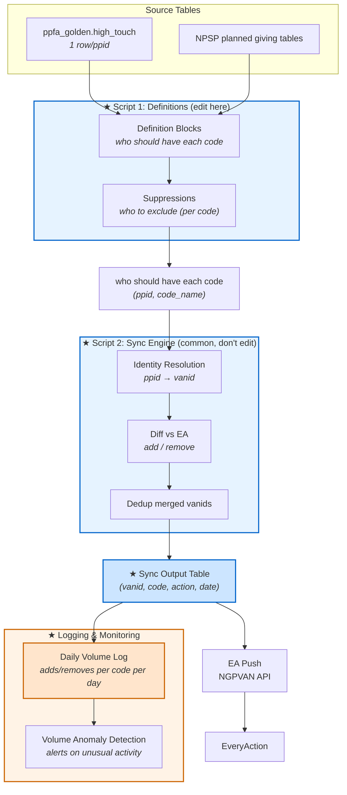

# Activist Code Sync — Stakeholder Summary

**Ticket:** [DSA-3433](https://app.asana.com/1/8719232879967/project/1213578586282357/task/1213737458627724?focus=true) | **Date:** 2026-03-30 | **Status:** Research / Discovery

---

## What Are Activist Codes?

Activist codes are tags in EveryAction (EA) that tell the email team how to treat a donor — who should get certain emails, who should be excluded, and which affiliates can contact them. These tags are based on donor information that lives in Salesforce (SF), like giving level, portfolio assignment, or planned giving status.

The challenge is that SF and EA don't talk to each other directly. Automated processes ("syncs") translate SF donor attributes into the right EA activist codes on a daily basis. The upstream source for most of these is the [Golden High Touch table](https://platform.civisanalytics.com/spa/#/scripts/sql/241686533), built daily from SF/NPSP data.

---

## Current State: How It Works Today

There are several separate processes that manage different sets of activist codes:

### Automated (Daily)

| Process | What It Does | Civis Links |
|---------|-------------|-------------|
| **Mid-Level & High Touch sync** | Looks at the Golden High Touch table (built daily from SF) and applies or removes Mid-Level, Mid-Level VIP, and High Touch codes in EA. Includes logic for upgrades/downgrades between Mid-Level tiers. Also covers PC Prospects/Invites and PC Upgrade lists. **Note:** The current script uses `giving_level` to identify Mid-Level donors, but the business definition is President's Circle (PC) via `managing_program` — row counts differ slightly between the two fields. Needs validation. | [Workflow](https://platform.civisanalytics.com/spa/#/workflows/32341) · [ML SQL](https://platform.civisanalytics.com/spa/#/scripts/sql/99330944) · [HT SQL](https://platform.civisanalytics.com/spa/#/scripts/sql/102285048) |
| **Action Fund Membership sync** | Applies or removes Lifetime and Contributing membership tags based on the Golden Membership table. | [Workflow](https://platform.civisanalytics.com/spa/#/workflows/108660) |

### Planned (Not Yet Running)

| Process | What It Does | Civis Links |
|---------|-------------|-------------|
| **Planned Giving sync** — [DSA-1845](https://app.asana.com/1/8719232879967/project/1213578586282357/task/1211447776598924?focus=true), [DSA-1848](https://app.asana.com/1/8719232879967/project/1213578586282357/task/1211457702886338?focus=true) | Identifies donors in PG segments (Legacy Society, Bequest, CGA, etc.) and applies PG-related codes. Currently paused — was add-only (never removes outdated codes) and had other gaps. Remove logic being added via DSA-1848: PG code removed when no active PG records remain on the account; Legacy Society code removed when the attribute is end-dated. Confirmed: all PG segments require PPFA designation — donors with only affiliate-designated planned gifts are excluded. All PPFA PG donors get High Touch + Planned Giving codes. Only donors with the Legacy Society attribute get the Legacy Society code. | [Workflow](https://platform.civisanalytics.com/spa/#/workflows/75818) · [PG SQL](https://platform.civisanalytics.com/spa/#/scripts/sql/202504702) |
| **CFP Affiliate sync** — [DSA-1656](https://app.asana.com/1/8719232879967/project/1213578586282357/task/1211163255897088?focus=true) | Would automatically tag High Touch donors in affiliate committees so CFP partners can segment their emails. Not yet built. Intended to replace the current PMG/CFP manual process (see below). The contactable vs. managed distinction is set in the Account Team Member definition — CFP portfolio assignment (not national team portfolio) identifies the affiliate-managed segment. EA supports **sharing rules** configurable per activist code in the front end (some codes shared, some not). 

### Manual

| Process | What It Does |
|---------|-------------|
| **PMG/CFP codes** | PMG Ops periodically pulls donor portfolios from SF (accounts with active Account Team Member assignments to PMG), has the Primary Prospect Manager review the list, then manually uploads confirmed donors to EA with the appropriate codes (High Touch: PMG, PMG CFI codes). Codes are removed manually when donors are downgraded from portfolio back to Mid-Level. PC uploads their portfolio as a Saved List regularly; PMG and PC use each other's lists as exclusions to prevent duplicate emails. There is no straightforward tracking process — confirmation requires pulling donor IDs and cross-referencing with SF. *(Source: Jeffrey Lin, 2026-03-25.)* The CFP Affiliate sync (above) is intended to automate and replace this process. See [CFP criteria](https://docs.google.com/document/d/184TKtTLNzmixKHlTsCaghkg-VFjMIclaRNZhAsHMOO0/edit). |

### Likely Inactive

| Process | What It Does | Civis Links |
|---------|-------------|-------------|
| **Hustle Rentals opt-in** | A workaround from 2022 for Hustle rentals. Last qualifying records are from 2022–2023. Pending confirmation on whether to decommission. | [Workflow](https://platform.civisanalytics.com/spa/#/workflows/77407) |

### Known Problems

- **High Touch code conflict:** The Mid-Level/HT sync and the Planned Giving sync both try to manage the same High Touch code (4484811). Because they run independently, one can remove what the other just added — creating a nightly add/remove cycle.
- **PG codes accumulate but are never cleaned up:** The PG sync only adds codes — it never removes them when a donor no longer qualifies. Over time this makes the codes unreliable. (Remove logic being added via DSA-1848.)
- **Nightly wipe of manually-applied codes:** The automated HT/ML sync removes codes from any donor not in its list. If someone manually applies a code (e.g., during a bulk upload), the nightly sync can wipe it before the system catches up.
- **No deceased filtering in HT/ML:** Deceased donors can continue to have active codes.
- **Manual processes are hard to track and audit:** No systematic record of when codes were added/removed or by whom.

---

## Proposal: Unified Sync

Replace the patchwork of separate processes with **one system** that manages all SF-sourced activist codes.

### How It Would Work

1. **One definitions script** — A single place that says: "Donors who meet *these criteria* in SF should have *this code* in EA." Each code's definition also includes its own exclusion rules — suppressions (e.g., board members, foundations) and deceased filtering — tailored to that specific code. Each code's rules are clearly written out and easy to review. Adding a new code means adding one short block of rules.

2. **One sync engine script** — Every day, the system:
   - Reads the definitions to determine who *should* have each code
   - Resolves donor identities (SF → EA)
   - Compares that against who *currently* has each code in EA
   - Pushes the differences: adds codes for new qualifiers, removes codes for donors who no longer qualify

3. **One output log** — Every add and remove is recorded with a timestamp, making it easy to audit what changed and when. The sync output table is **additive** (append-only) — rows are never deleted, preserving full history for audit and debugging.

4. **Daily volume log** — After each sync, a summary table records the number of adds and removes per code per day. Provides at-a-glance monitoring and historical baselines.

5. **Monitoring & alerts** — A notification script sends email alerts if the workflow fails or if daily add/remove volume for any code falls outside the normal range (mean ± 2 standard deviations), flagging potential data issues before they reach EA.

### Visual Overview

### What Changes

| Today | Proposed |
|-------|----------|
| Code definitions are buried across multiple scripts in different locations | All definitions in one place — easy to read, review, and update |
| High Touch code conflict between two separate processes | One process owns each code — no conflicts possible |
| PG codes are never removed | Automatic removal when a donor no longer qualifies |
| Manually-applied codes can be wiped by nightly sync | Option to protect manually-applied codes from automated removal |
| No deceased filtering in HT/ML | Can add deceased filtering for any code that needs it |
| Adding a new code requires building a new process from scratch | Adding a new code = adding a short definition block |
| No central audit trail | Every change is logged with a timestamp |

### Rollout Plan

| Phase | What |
|-------|------|
| **1 — Build** | Build the unified system with Mid-Level + High Touch codes (replacing the existing automated sync) |
| **2 — Validate** | Run old and new systems side-by-side to validate they produce the same results |
| **3 — Cutover** | Switch over to the new system for ML + HT. Retire old scripts. |
| **4 — Expand** | Add Planned Giving codes to the unified system |
| **5 — Expand** | Add CFP Affiliate codes |

### Scope

**Not in scope for this effort** (could be migrated into the unified system in the future):
- **Action Fund Membership** — uses a different mechanism (survey questions, tracker table) than activist codes
- **Contributing membership** — uses survey questions instead of an activist code; stays with AF workflow
- **Hustle Rentals** — likely inactive; pending decommission confirmation
- **PMG: No Email** — team preference, not data-driven
- **EA-only codes** — codes not driven by SF data

---

## Proposals for Stakeholder Input

1. **Manual code protection**: The automated sync should **skip removal** for codes that were applied manually (i.e., not by a previous sync run). This prevents the nightly wipe issue while still allowing automation to manage its own codes. Manual overrides persist until explicitly removed by a person.

2. **Corporate, Foundations, National Board, PMG-specific codes**: The specific codes are Corporate (4490499), Foundations (4490505), National Board (4490261), PMG (4490493). The data is already in the Golden HT table. Three options:
   - A. Apply only the general High Touch code (4484811) — the specific codes are redundant
   - **B. Apply both the general HT code and the specific sub-codes — preserves affiliate-blocking behavior (via HT) while giving email teams finer segmentation. Minimal additional effort since the data already exists. (Recommended.)**
   - C. Apply only the specific sub-codes, no general HT code for these donors

3. **Hustle Rentals**: **Decommission** this workflow. Last qualifying records are from 2022–2023, it runs in under a minute, and DFSE confirmation is pending. Turn it off and monitor for any impact.

---

**Related documentation:**
- [Full technical research document](Activist%20Code%20Workflows%20-%20Summary%20and%20Proposal.md)
- [Golden HT table description](https://docs.google.com/document/d/1IogCzDtijZfcxJNNFvgSMLBaOHP9NUrck2OciKMddqc/edit) — column definitions and business logic
- [Golden HT table workflow](https://platform.civisanalytics.com/spa/#/workflows/107235)
- [CFP Affiliate criteria](https://docs.google.com/document/d/184TKtTLNzmixKHlTsCaghkg-VFjMIclaRNZhAsHMOO0/edit) — SF field definitions for PC and PMG segments
- [EA HT & Direct Mail Committees Data](https://docs.google.com/document/d/1M8_6QUgL59AXbbYCPc2Gmk-TVIEsJE2ASiZ6PVxcWL0/edit) — **ARCHIVED** — older doc for ML/HT workflow
