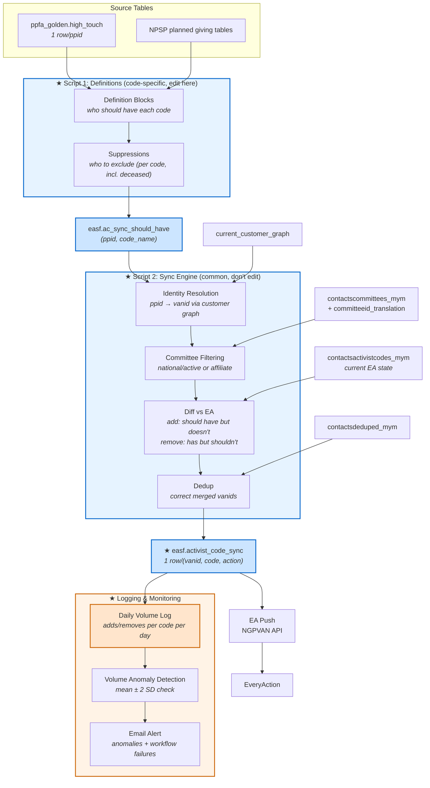

# Activist Code Workflows — Summary & Unified SF→EA Sync Proposal

**Ticket:** [DSA-3433](https://app.asana.com/1/8719232879967/project/1213578586282357/task/1213737458627724?focus=true)
**Date:** 2026-03-30
**Status:** Research / Discovery

## Table of Contents

1. [Summary](#1-summary)
2. [Inventory of Existing Workflows](#2-inventory-of-existing-activist-code-workflows)
   - [2.0 Golden HT Table](#20-golden-high-touch-table-upstream) | [2.1 Mid-Level & HT](#21-mid-level--high-touch-activist-code-sync-active--dsa-1848) | [2.2 PG](#22-planned-giving-pg-activist-codes-planned--dsa-1845) | [2.3 CFP Affiliate](#23-cfp-affiliate-activist-code-sync-planned-not-yet-coded--dsa-1656) | [2.4 Action Fund](#24-action-fund-membership-updates-active) | [2.5 Hustle Rentals](#25-hustle-rentals-opt-in-activist-codes-likely-inactive) | [2.6 Manual](#26-manual-processes) | [2.7 Operational](#27-operational-details)
3. [Comparison Matrix](#3-comparison-matrix-sfea-workflows-only)
4. [Shared Infrastructure & Key Differences](#4-shared-infrastructure--key-differences)
5. [Proposal: Unified SF→EA Sync](#5-proposal-unified-sfea-sync)
   - [5.1 Design Principles](#51-design-principles) | [5.2 Definitions](#52-script-1-definitions-step1_definitionssql) | [5.3 Sync Engine](#53-script-2-sync-engine-step2_sync_enginesql) | [5.4 Worked Example](#54-worked-example-mid-level-4402903) | [5.5 EA Push](#55-ea-push-single-workflow) | [5.6 What Changes](#56-what-changes-vs-today) | [5.7 Migration](#57-migration-path)
6. [Open Questions](#6-open-questions)
7. [File Inventory](#7-file-inventory)

**Appendices:** [A. Key Concepts](#appendix-a-key-concepts) | [B. Data Flow Diagram](#appendix-b-data-flow-diagram) | [C. Activist Code Catalog](#appendix-c-complete-activist-code-catalog) | [D. Reference: Data Pipeline & Tables](#appendix-d-reference--data-pipeline--tables)

---

# 1. Summary

SF is the offline system of record for donor classification. EA is the online/email system. Functional SF attributes must be translated into EA activist codes so email teams know what SF says about a donor. (See Appendix A for definitions of activist codes and committees.)

**Problem**: Today this translation happens in multiple separate workflows — any automated Civis-to-EA push that applies activist codes or survey responses based on upstream data. The definitions of *which attributes map to which EA codes* are **buried in SQL scripts**. Not every EA activist code comes from an automated pipeline — some are EA-only or manually applied. Those are out of scope.

**Goal**: Replace the current patchwork with:
1. **A definitions layer** — a single table where each row maps an SF attribute/condition to an EA activist code. Easy to read, add, edit.
2. **A single sync process** — one workflow that reads those definitions, diffs against current EA state, and pushes add/remove operations

---

# 2. Inventory of Existing Activist Code Workflows

## 2.0 Golden High Touch Table (Upstream)

`ppfa_golden.high_touch` — primary source of truth. Built daily from NPSP data. 1 row per ppid.
[Civis script](https://platform.civisanalytics.com/spa/#/scripts/sql/241686533) | [Golden Table workflow](https://platform.civisanalytics.com/spa/#/workflows/107235) | Columns & source tables: see Appendix D.

---

## 2.1 Mid-Level & High Touch Activist Code Sync (Active) — [DSA-1848](https://app.asana.com/1/8719232879967/project/1213578586282357/task/1211457702886338?focus=true)

**Status:** Active | **Codes:** High Touch (4484811), Mid-Level (4402903), Mid-Level VIP (4444102)
[Civis workflow](https://platform.civisanalytics.com/spa/#/workflows/32341) | Docs: [PC Activist Codes](https://docs.google.com/document/d/1woqAkJHe-YJiWybyIh2iJ89IfVX53JtGBB5WGKYUw7U/edit), [QA Notes](https://docs.google.com/spreadsheets/d/1k3JHEGc9c52rD4it3Lm06iRq2THTlYzdOSvJpN8UzLw/edit), [EA HT & Direct Mail](https://docs.google.com/document/d/1M8_6QUgL59AXbbYCPc2Gmk-TVIEsJE2ASiZ6PVxcWL0/edit), [Golden HT Description](https://docs.google.com/document/d/1IogCzDtijZfcxJNNFvgSMLBaOHP9NUrck2OciKMddqc/edit)

6 sequential Civis jobs. Determines who should have ML/HT codes from `high_touch` table, diffs against current EA state, pushes adds/removes.

| Step | Script | What |
|------|--------|------|
| 1 | [Mid-Level SQL](https://platform.civisanalytics.com/spa/#/scripts/sql/99330944) | Builds `easf.midlevelcodesync` from `high_touch.giving_level` |
| 2 | [ML Remove](https://platform.civisanalytics.com/spa/#/scripts/containers/99367808) | Removes outdated ML/VIP codes (4402903, 4444102) from VAN |
| 3 | [ML Add](https://platform.civisanalytics.com/spa/#/scripts/containers/99369225) | Applies ML/VIP codes (4402903, 4444102) to VAN |
| 4 | [High Touch SQL](https://platform.civisanalytics.com/spa/#/scripts/sql/102285048) | Builds `easf.hightouchcodesync` from all `high_touch` rows |
| 5 | [HT Add](https://platform.civisanalytics.com/spa/#/scripts/containers/102286793) | Applies High Touch code (4484811) to VAN |
| 6 | [HT Remove](https://platform.civisanalytics.com/spa/#/scripts/containers/102286874) | Removes High Touch code (4484811) from VAN |

- **Mid-Level**: currently uses `giving_level ILIKE '%mid%'` (not major). VIP → 4444102; High/Low → 4402903. **Note:** The business definition of Mid-Level is President's Circle (PC), which maps to `managing_program` (e.g., "President's Circle - Midlevel Low/High/VIP"). The email lists team uses `managing_program` rather than `giving_level`. Row counts differ slightly between the two fields — needs validation before deciding which to use in the unified sync.
- **Mid-Level suppressions**: national board, foundations, corporations, managed accounts, prospect management (except Discovery). **Open question:** Confirm that PMG is suppressed from ML codes (as well as foundations & corp), and whether these suppressions are still needed.
- **High Touch**: all rows in `high_touch` table. No suppressions. Code 4484811 **prevents affiliate sharing**.
- Handles add, remove, upgrade (4402903→4444102), downgrade (4444102→4402903)
- ~8,200–8,300 vanids updated daily

---

## 2.2 Planned Giving (PG) Activist Codes (Planned) — [DSA-1845](https://app.asana.com/1/8719232879967/project/1213578586282357/task/1211447776598924?focus=true)

**Status:** Planned (failed April 2025, being reworked) | **Codes:** Planned Giving (4490504), High Touch (4484811), Legacy Society (4658459)
[Civis workflow](https://platform.civisanalytics.com/spa/#/workflows/75818) | Docs: [Discovery](https://docs.google.com/document/d/1lVL0qNhwA0iiffBEpIFVxi30tZ0nE65e6h7fwvyFCmM/edit), [PG Lists & Segmentation (older version)](https://docs.google.com/document/d/1_18gXCaPQ93_6BPqtAxRZQaTwWESppy8xS2FCTf1k2E/edit), [Segment definitions](https://docs.google.com/spreadsheets/d/1bUYGvrS0RDo93f8IpQfVnK5_MLK105WhSXmNdz04uB0/edit)

Identifies PG segments from NPSP data and pushes activist codes to EA. Currently **add-only** (no remove), no committee filtering, no dedup. Remove logic is being added via [DSA-1848](https://app.asana.com/1/8719232879967/project/1213578586282357/task/1211457702886338?focus=true) — removal criteria confirmed: PG code removed when no active PG records remain on the account (Bequest Intent: Closed/Lost or Awaiting Estate; LIG: Severed or Matured; Special Gift: Closed/Lost). Donors with multiple PG records keep the code if any record is still active. Legacy Society code removed when the attribute is end-dated.

**Segments:** PG Portfolio, Legacy Society, Bequest Intent, Bequest Inquiry, LIG Established, LIG Inquiry, CGA. Full definitions in Appendix D.

| Step | Script | What |
|------|--------|------|
| 1 | [PG SQL](https://platform.civisanalytics.com/spa/#/scripts/sql/202504702) ([dev](https://platform.civisanalytics.com/spa/#/scripts/sql/344124514)) | Builds segment table + activist code flags |
| 2 | [HT push](https://platform.civisanalytics.com/spa/#/scripts/containers/206758006) | Apply High Touch (4484811) where `HighTouch = 'Y'` |
| 3 | [LS push](https://platform.civisanalytics.com/spa/#/scripts/containers/171120646) | Apply Legacy Society (4658459) where `LegacySociety = 'Y'` |
| 4 | [PG push](https://platform.civisanalytics.com/spa/#/scripts/containers/171121189) | Apply Planned Giving (4490504) where `PlannedGiving = 'Y'` |

- **Resolved:** PG Portfolio → HT AC: confirmed — all PPFA PG donors get High Touch + Planned Giving codes. PPFA designation filter: confirmed — all PG segments require PPFA designation; affiliate-only planned gifts (Bequest, Life Income Gift, Special Gift) are excluded from automation. CGA filter removed. Account level confirmed. Deceased filter = PPID only.
- **Open:** CFP segment may be dropped.

---

## 2.3 CFP Affiliate Activist Code Sync (Planned, Not Yet Coded) — [DSA-1656](https://app.asana.com/1/8719232879967/project/1213578586282357/task/1211163255897088?focus=true)

**Status:** Planning (not yet coded) | **Codes:** Likely High Touch (4484811) at affiliate level
Docs: [CFP criteria](https://docs.google.com/document/d/184TKtTLNzmixKHlTsCaghkg-VFjMIclaRNZhAsHMOO0/edit)

**Goal:** CFP affiliates currently manually upload donor lists into EA to tag them with High Touch/PMG codes so they can send segmented emails. This project automates that — if a donor is High Touch for PPFA and exists in both federated + CFP affiliate committees, auto-apply the HT code in the affiliate committee. Full criteria in Appendix D.

**Current manual process (from Jeffrey/PMG Ops):**
- PMG Ops periodically pulls PMG donor portfolios from SF (accounts with active Account Team Member assignments)
- Primary Prospect Manager reviews whether household members should be on the PMG eblast list
- Confirmed donors are uploaded to EA with the appropriate code (High Touch: PMG or PMG CFI codes)
- Codes are removed manually when donors are downgraded from portfolio back to Mid-Level
- PC uploads their portfolio as a Saved List regularly; PMG and PC use each other's lists as exclusions to prevent duplicate emails
- No straightforward tracking process — confirmation is done by pulling vanids and cross-referencing with SF

**Resolved:** Account Team Member exclusion — not excluding. Instead, tag all qualifying donors as High Touch in affiliate committees, and PC team will coordinate with affiliates on engagement for donors assigned to PPFA fundraisers.

**Open:** Contactable vs. managed distinction (affiliates can't currently tell which HT donors are managed by a PPFA fundraiser). PC portfolio subcategories.

---

## 2.4 Action Fund Membership Updates (Active)

**Status:** Active | **Codes:** Lifetime membership (4304186) + Contributing membership (survey 203939/860303)
[Civis workflow](https://platform.civisanalytics.com/spa/#/workflows/108660)

Syncs Action Fund membership status from `ppfa_golden.golden_membership` to EA. Has add + remove logic. Uses a tracker table for idempotency.

| Step | Script | What |
|------|--------|------|
| 1 | [Tracker insert](https://platform.civisanalytics.com/spa/#/scripts/sql/279074738) | Builds add/remove rows from `golden_membership` |
| 2a | [Contributing push](https://platform.civisanalytics.com/spa/#/scripts/containers/110416123) | Apply survey Q 203939/R 860303 to VAN (input_type 11, contact_type 78) |
| 2b | [Lifetime push](https://platform.civisanalytics.com/spa/#/scripts/containers/110414787) | Apply/remove Lifetime AC (4304186) to VAN (input_type 11, contact_type 78) |
| 3 | [Tracker update](https://platform.civisanalytics.com/spa/#/scripts/sql/280280663) | Mark processed |

- Contributing membership uses survey question/response (not an activist code)
- "Removal" uses backdated canvass date (2021-01-01) workaround since survey responses can't be directly removed in EA

---

## 2.5 Hustle Rentals Opt-In Activist Codes (Likely Inactive)

**Status:** Likely inactive — pending confirmation from DFSE | [Civis workflow](https://platform.civisanalytics.com/spa/#/workflows/77407)

Workaround for Hustle rentals where activist codes couldn't be applied directly — survey questions were applied instead, then this workflow converted them to activist codes. Part of a 2022-era effort to expand C4 and Votes lists via rentals.

| Step | Script | What |
|------|--------|------|
| 1 | [C4→Votes push](https://platform.civisanalytics.com/spa/#/scripts/containers/172998700) | Apply PP Votes code (4475017) to vanids with survey Q 535749. Last qualifying record: 2022. |
| 2 | [C3→C4 push](https://platform.civisanalytics.com/spa/#/scripts/containers/173331051) | Apply C4 Opt-in code (4132411) to vanids with survey Q 175872/R 745599. Last qualifying record: 2023. |

**Per Anna Rhodes (2026-03-25):** Only 1 vanid from 2022 remains for C4→Votes; C3→C4 most recent response is 2023. Likely not in use. Ariel to confirm with DFSE whether the survey question is still active. Runs in <1 min so not urgent to clean up.

---

## 2.6 Manual Processes

- **PMG/CFP codes** — PMG Ops periodically pulls donor portfolios from SF (accounts with active Account Team Member assignments to PMG), has the Primary Prospect Manager review whether household members should be on the PMG eblast list, then manually uploads confirmed donors to EA with the appropriate code (High Touch: PMG or PMG CFI codes). Codes are removed manually when donors are downgraded from portfolio back to Mid-Level. PC uploads their portfolio as a Saved List regularly; PMG and PC use each other's lists as exclusions to prevent duplicate emails. No straightforward tracking process — confirmation requires pulling VANIDs and cross-referencing with SF. *(Source: Jeffrey Lin, 2026-03-25.)* **Note:** The CFP Affiliate sync (2.3) is intended to automate and replace this manual process.

---

## 2.7 Operational Details

| Workflow | Cadence | Status |
|----------|---------|--------|
| Golden High Touch table build | Daily ~7am | Active |
| Mid-Level & High Touch sync (2.1) | Daily ~8pm (after golden build) | Active |
| Planned Giving sync (2.2) | Was daily — currently paused | Planned |
| CFP Affiliate sync (2.3) | N/A | Not yet coded |
| Action Fund Membership (2.4) | Daily | Active |
| Hustle Rentals (2.5) | Multiple times/day | Likely inactive — confirming with DFSE |
| PMG/CFP manual codes (2.6) | Periodic (ad hoc) | Manual — to be replaced by CFP Affiliate sync (2.3) |
| IDR (identity resolution) | Weekly (Saturdays) | Active |

- **SLA**: 4 business days from gift entry in SF. 6 days for new vanids (Saturday IDR).
- **Production since**: Nov 2020 (restarted Oct 2022)
- **Contacts**: Anna Rhodes (scripts), Ariel (Golden HT table)

---

# 3. Comparison Matrix (SF→EA Workflows Only)

| Dimension | ML & HT (2.1) | Planned Giving (2.2) | CFP Affiliate (2.3) | AF Membership (2.4) | Hustle Rentals (2.5) | PMG/CFP Manual (2.6) |
|-----------|---------------|---------------------|---------------------|---------------------|---------------------|---------------------|
| **Status** | Active | Planned | Planning | Active | Likely inactive | Manual — to be replaced by 2.3 |
| **# of codes** | 3 | 3 | TBD | 1 (+ survey Q) | 2 | PMG + 9 PMG CFI codes |
| **Source of truth** | `high_touch` | NPSP planned giving | SF managing program | `golden_membership` | Hustle rental data | SF Account Team Members (manual pull) |
| **Suppressions** | ML: board/foundation/corp/pmg. HT: none | Deceased only | TBD | None | None | Prospect Manager review |
| **Committee scope** | National/active | National | Affiliate | C4 (Action Fund) | C3→C4, C4→Votes | National + affiliate |
| **Dedup** | Yes | None | TBD | None | None | None |
| **Add/Remove** | Add, remove, upgrade, downgrade | **Add only** | TBD | Add + remove | Add only? | Add + remove (manual) |
| **Output table** | `easf.midlevelcodesync`, `easf.hightouchcodesync` | `lists_audiences_segments.*` | TBD | `vansync_projects.*` | Direct push | Direct upload to EA |
| **Deceased filter** | **No** | Yes | TBD | No | No | No |
| **Overlapping code** | 4484811 | 4484811 — **conflict risk** | TBD | — | — | 4484811 (PMG HT) |
| **Frequency** | Daily | Paused | TBD | Daily | Multiple times/day | Periodic (ad hoc) |
| **Special** | — | — | — | Tracker table + survey Qs | Cross-committee push | No tracking system; VANID cross-referencing with SF for confirmation |

---

# 4. Shared Infrastructure & Key Differences

## What's Shared

All SF→EA workflows follow this pattern:

1. **Determine who should have a code** — query a source-of-truth table
2. **Resolve identities** — `current_customer_graph` maps ppid → vanid
3. **Filter committees** — `committeeid_translation` restricts to national/active
4. **Diff against current state** — compare against `vansync.ppfa_contactsactivistcodes_mym`
5. **Dedup vanids** — `ppfa_contactsdeduped_mym` handles merges
6. **Push via API** — Civis NGPVAN export jobs

## Key Differences

| Difference | Impact |
|-----------|--------|
| **Suppression logic** varies by workflow | Mid-level has extensive suppressions; high touch has none; PG excludes only deceased |
| **PG workflow is add-only** | No remove logic — codes accumulate but are never cleaned up |
| **PG has no dedup step** | Merged vanids not handled — could cause duplicate pushes |
| **PG has no committee filtering** | Uses `allsupporters` intermediary instead of `committeeid_translation` |
| **Output table locations are inconsistent** | `easf.*` vs `lists_audiences_segments.*` |
| **Code references differ** | Some use numeric IDs (4484811), others use name lookups ("Legacy Society") |
| **Mid-Level and High Touch share a workflow** | Already partially consolidated — run sequentially in one YAML |
| **PG is separate and disconnected** | Different location (DSA-1845), different output schema, different delivery mechanism |
| **HT/ML has no deceased filter** | Deceased contacts in the golden HT table continue getting codes applied |

## Known Issues & Risks

### High Touch Code Overlap/Conflict (Critical)

Both the HT/ML pipeline (2.1) and PG pipeline (2.2) manage the **same activist code**: High Touch (4484811). This creates a conflict:

1. A donor qualifies for High Touch via PG (e.g., Legacy Society member)
2. PG pipeline adds the HT code
3. That donor is NOT in `ppfa_golden.high_touch` (they're PG, not a giving-level-based HT contact)
4. HT/ML pipeline's nightly run sees an HT code on a vanid not in its "should have" list → **removes it**
5. Next PG run adds it back → **cycle repeats nightly**

**Resolution**: The unified sync must combine both HT/ML and PG sources into a single "should have High Touch" set before diffing. This is a primary motivation for consolidation.

### Nightly Wipe of Manually-Applied Codes

The HT/ML pipeline removes ALL High Touch/Mid-Level/Mid-Level VIP codes each night for vanids not in its "should have" list. This means:
- **Bulk uploads**: When contacts are bulk-uploaded to EA with HT codes manually applied, the nightly run wipes those codes until the IDR matches the vanid (up to 6 days after the next Saturday IDR run). The `PPOL: No Comm` code should be applied during this gap.
- **Staff-applied codes**: HT staff who manually apply codes may see them removed overnight if the contact doesn't qualify via the automated pipeline.

**Open question**: Should the unified sync have a "manual override" flag to protect manually-applied codes from automated removal?

### Missing Deceased Filter in HT/ML

The HT/ML pipeline does not exclude deceased contacts. If a deceased person remains in `ppfa_golden.high_touch`, they continue getting activist codes. The PG pipeline correctly filters deceased via `ppfa_golden.golden_diversity`. Whether the unified sync should apply deceased filtering to all codes, some codes, or none is an open question (see section 6).

### Committee Filtering May Be Unnecessary

QA testing (Jan 2023) confirmed that AC changes via the C3 API **automatically propagate to C4 and High Touch committees**. The committee filtering in the HT/ML pipeline may be adding complexity and potentially filtering out valid vanids. The unified sync should evaluate whether this step can be simplified or removed.

### Inconsistent Identity Resolution

The PG pipeline uses `dfse_ads.allsupporters` as an intermediary for vanid resolution, while HT/ML uses `current_customer_graph` + committee filtering. The unified sync should use a consistent path for all codes.

---

# 5. Proposal: Unified SF→EA Sync

## 5.1 Design Principles

1. **Two SQL scripts**: **Script 1 — Definitions** (edit here — who should have each code, per-code suppressions incl. deceased) and **Script 2 — Sync Engine** (don't edit — identity resolution, committee filtering, diff, dedup)
2. **Adding a new code = adding a definition block**: copy a template, fill in the source query and suppression
3. **Single output table**: all codes write to one `easf.activist_code_sync` table
4. **Explicit everything**: suppressions, committee scope visible as labeled blocks — not buried in joins

## 5.2 Script 1: Definitions (`step1_definitions.sql`)

Each activist code gets **exactly one definition block**. To add a new code, copy a block and edit the queries. To disable, comment it out.

**Constraint: one definition per code.** Each activist code ID must appear in exactly one `should_have_*` table. If multiple sources contribute to the same code (e.g., High Touch comes from both the golden HT table and PG segments), they must be UNIONed into a single definition block. This prevents the conflict where separate pipelines add/remove the same code independently.


**Example 1: Simple definition (no suppressions)**

```sql
-- ---------- HIGH TOUCH (4484811) ----------
-- Combined from: golden HT table (all rows) + PG segments (qualifying donors).
CREATE TEMP TABLE should_have_hightouch AS (
    SELECT DISTINCT ppid FROM ppfa_golden.high_touch
    UNION
    SELECT DISTINCT ppid FROM {pg_segment_table}
    WHERE legacy_society = 'Y' OR bequest_intent = 'Y'
    OR bequest_inquiry = 'Y' OR lig_established = 'Y'
    OR lig_inquiry = 'Y' OR cga = 'Y'
);
```

**Example 2: Definition with suppressions**

```sql
-- ---------- MID-LEVEL (4402903) ----------
CREATE TEMP TABLE should_have_midlevel AS (
    SELECT DISTINCT ppid FROM ppfa_golden.high_touch
    WHERE giving_level ILIKE '%mid%'
    AND giving_level NOT ILIKE '%major%'
    AND giving_level NOT ILIKE '%Mid-Level VIP%'
);
CREATE TEMP TABLE suppress_midlevel AS (
    SELECT ppid FROM ppfa_golden.high_touch
    WHERE board_member LIKE '%National%'
    OR (foundation IS NOT NULL OR planned_giving IS NOT NULL
        OR corporations IS NOT NULL)
    OR prospect_management NOT LIKE '%Discovery%'
);
DELETE FROM should_have_midlevel
WHERE ppid IN (SELECT ppid FROM suppress_midlevel);
```

Additional codes follow the same pattern. See `step1_definitions.sql` for the full set.


**The key shift:** Today these definitions are spread across 200+ line scripts in different folders. In the new system, they're all in one script — scannable, commentable, version-controllable. Adding a code = copying a 10-line block.

## 5.3 Script 2: Sync Engine (`step2_sync_engine.sql`)

Reads from `easf.ac_sync_should_have` (output of Script 1) and runs the common logic: identity resolution (ppid → vanid), committee filtering, diff vs current EA state, and dedup. This script doesn't need editing when adding codes.

```sql
-- ============================================================
-- SYNC ENGINE (don't edit below)
-- ============================================================

-- Master list of codes to process (add new codes here)
CREATE TEMP TABLE codes_to_sync (
    code_name       VARCHAR(100),
    code_id         INT,
    enable_remove   BOOLEAN
);
INSERT INTO codes_to_sync VALUES
    ('hightouch',       4484811, TRUE),
    ('midlevel',        4402903, TRUE),
    ('midlevel_vip',    4444102, TRUE),
    ('legacy_society',  4658459, TRUE),
    ('planned_giving',  4490504, TRUE),
    ('corporate',       4490499, TRUE);

-- Step 3: UNION all should_have tables + resolve ppid → vanid (ONE PASS)
-- NOTE: each code_name must appear exactly once here, matching the definition blocks above.
CREATE TEMP TABLE all_should_have AS (
    SELECT 'hightouch' AS code_name, ppid FROM should_have_hightouch  -- already includes PG sources
    UNION ALL SELECT 'midlevel', ppid FROM should_have_midlevel
    UNION ALL SELECT 'midlevel_vip', ppid FROM should_have_midlevel_vip
    UNION ALL SELECT 'legacy_society', ppid FROM should_have_legacy_society
    UNION ALL SELECT 'planned_giving', ppid FROM should_have_planned_giving
    UNION ALL SELECT 'corporate', ppid FROM should_have_corporate
    -- add new codes here
);

CREATE TEMP TABLE all_should_have_vanids AS (
    SELECT DISTINCT a.code_name, ccg.source_primary_key AS vanid
    FROM all_should_have a
    JOIN ppfa_golden.current_customer_graph ccg
        ON a.ppid = ccg.resolved_id
    WHERE ccg.source = 'van'
);

-- Step 4: Committee filtering (ONE PASS for all national-scoped codes)
CREATE TEMP TABLE all_eligible AS (
    SELECT DISTINCT a.code_name, a.vanid
    FROM all_should_have_vanids a
    JOIN vansync.ppfa_contactscommittees_mym cc ON a.vanid = cc.vanid
    JOIN ppfa_golden.committeeid_translation ct ON cc.committeeid = ct.committeeid
);

-- Step 5: Diff against current EA state (PER CODE — different code IDs)
-- Additive — INSERT new rows each run (no truncate, preserves history)

-- For each code in codes_to_sync:
-- ADD: in eligible but not in EA
INSERT INTO easf.activist_code_sync (code_name, vanid, action, activist_code_id, sync_date)
SELECT e.code_name, e.vanid, 'add', c.code_id, CURRENT_DATE
FROM all_eligible e
JOIN codes_to_sync c ON e.code_name = c.code_name
LEFT JOIN vansync.ppfa_contactsactivistcodes_mym ac
    ON e.vanid = ac.vanid AND ac.activistcodeid = c.code_id
WHERE ac.vanid IS NULL;

-- REMOVE: in EA but not in eligible (for codes with enable_remove = TRUE)
INSERT INTO easf.activist_code_sync (code_name, vanid, action, activist_code_id, sync_date)
SELECT c.code_name, ac.vanid, 'remove', c.code_id, CURRENT_DATE
FROM vansync.ppfa_contactsactivistcodes_mym ac
JOIN codes_to_sync c ON ac.activistcodeid = c.code_id AND c.enable_remove = TRUE
LEFT JOIN all_eligible e ON ac.vanid = e.vanid AND e.code_name = c.code_name
WHERE e.vanid IS NULL;

-- Step 6: Dedup merged vanids (ONE PASS on output table)
UPDATE easf.activist_code_sync
SET vanid = cd.vanid
FROM vansync.ppfa_contactsdeduped_mym cd
WHERE easf.activist_code_sync.vanid = cd.dupvanid;
```

## 5.4 Worked Example: Mid-Level (4402903)

How the current [`mid-level_activist_codes.sql`](https://platform.civisanalytics.com/spa/#/scripts/sql/99330944) (163 lines) maps to the proposed system.

**Definition block** (steps 1-2, top of script — the only part that's code-specific):

```sql
-- ---------- MID-LEVEL (4402903) ----------
-- Today: lines 71-89 of mid-level_activist_codes.sql
CREATE TEMP TABLE should_have_midlevel AS (
    SELECT DISTINCT ppid FROM ppfa_golden.high_touch
    WHERE giving_level ILIKE '%mid%'
    AND giving_level NOT ILIKE '%major%'
    AND giving_level NOT ILIKE '%Mid-Level VIP%'  -- VIP handled separately
);

-- Today: lines 61-68 (suppression table) + line 88 (NOT EXISTS)
CREATE TEMP TABLE suppress_midlevel AS (
    SELECT ppid FROM ppfa_golden.high_touch
    WHERE board_member LIKE '%National%'
    OR (foundation IS NOT NULL OR planned_giving IS NOT NULL
        OR corporations IS NOT NULL)
    OR prospect_management NOT LIKE '%Discovery%'
);
DELETE FROM should_have_midlevel
WHERE ppid IN (SELECT ppid FROM suppress_midlevel);
```

Then the sync engine (5.3) handles the rest in batch — midlevel ppids are UNIONed with all other codes, identity resolution and committee filtering run once, diff runs per-code against `activistcodeid = 4402903`, and dedup runs once on the final output. The only per-code config is the row `('midlevel', 4402903, TRUE)` in `codes_to_sync` and the UNION line in step 3.

> **Upgrade/downgrade**: Today's script has special-case logic for switching between 4402903 and 4444102 (lines 109-132). In the unified sync, `midlevel` and `midlevel_vip` are separate definitions — if someone moves from Mid-Level to VIP, `midlevel` produces a remove and `midlevel_vip` produces an add in the same run. No special-case code needed.

---

### Unified Output Table

```sql
CREATE TABLE easf.activist_code_sync (
    code_name          VARCHAR(100),
    vanid              BIGINT,
    action             VARCHAR(10),     -- 'add' or 'remove'
    activist_code_id   INT,
    sync_date          DATE,
    processed          BOOLEAN DEFAULT FALSE,
    processed_date     TIMESTAMP
);
-- Push workflow reads WHERE processed = FALSE, then marks processed = TRUE + timestamp.
-- OPEN QUESTION: Should this table be additive (append-only, preserves history for
-- audit/debugging) or truncated daily (simpler, but loses history)?
```

## 5.5 EA Push (Single Workflow)

One Civis workflow that:
1. Runs the sync engine (one SQL script)
2. Reads `easf.activist_code_sync WHERE processed = FALSE`
3. Pushes adds and removes to EA via NGPVAN API
4. Marks rows as `processed = TRUE`

## 5.6 What Changes vs. Today

| Today | Proposed |
|-------|----------|
| Mid-level logic in [`mid-level_activist_codes.sql`](https://platform.civisanalytics.com/spa/#/scripts/sql/99330944) (200+ lines) | ~10-line definition block in unified script |
| High touch logic in [`create_...high_touch...sql`](https://platform.civisanalytics.com/spa/#/scripts/sql/102285048) | ~5-line definition block |
| PG logic in [`planned_giving...sql`](https://platform.civisanalytics.com/spa/#/scripts/sql/202504702) (275 lines, separate location) | 3 definition blocks in same script |
| Suppressions baked into mid-level SQL only | Explicit suppression blocks per code — some codes have them, some don't |
| 3 different output tables in 3 schemas | One table: `easf.activist_code_sync` |
| PG has no remove logic | Remove logic built into sync engine for all codes |
| PG has no dedup step | Dedup built into sync engine |
| HT/ML has no deceased filter | Deceased suppression block available for any code that needs it |
| HT code conflict between HT/ML and PG pipelines | Single "should have" set per code — no conflict possible |
| PG uses different ID resolution path (`allsupporters`) | Consistent identity resolution for all codes |
| Adding a new code = write a new SQL script + new workflow tasks | Copy a definition block (~10 lines) |
| Mid-level upgrade/downgrade is special-cased | Handled naturally: remove old code + add new code in same sync run |

## 5.7 Migration Path

| Phase | What | Effort |
|-------|------|--------|
| **1 — Build** | Create `easf.activist_code_sync` output table. Write unified SQL script with definition blocks (Mid-Level + High Touch) and sync engine. | Medium |
| **2 — Validate** | Run new sync in parallel with existing workflow. Validate by comparing row counts per code and diffing vanid sets per code between old and new outputs. Investigate any discrepancies before proceeding. | Low |
| **3 — Cutover** | Cut over Mid-Level + High Touch to new workflow. Decommission old scripts. | Low |
| **4 — Expand** | Add Planned Giving definition blocks to the unified script. | Low |
| **5 — Expand** | Add CFP Affiliate definition blocks. | Low |

### Scope

**Not in scope for the unified sync:**
- **Action Fund membership (2.4):** Uses a tracker table pattern and survey questions (not just activist codes). Remains a separate workflow.
- **Contributing membership (2.4):** Uses survey question 203939/860303 instead of an activist code. Stays with AF workflow.
- **Hustle Rentals (2.5):** Likely inactive. Cross-committee push with inline diffing against survey responses. Pending decommission confirmation from DFSE.
- **PMG: No Email (4644776):** Team preference, stays manual.
- **EA-only codes:** Codes not sourced from upstream data are out of scope.

## 5.8 Logging & Monitoring

### Daily Volume Log

After each sync run, a summary table aggregates the sync output by day and code:

```sql
CREATE TABLE easf.activist_code_sync_daily_log (
    sync_date          DATE,
    code_name          VARCHAR(100),
    activist_code_id   INT,
    adds               INT,
    removes            INT,
    net_change          INT,
    total_active       INT      -- count of vanids with this code after sync
);

-- Populated after each sync run:
INSERT INTO easf.activist_code_sync_daily_log
SELECT
    sync_date,
    code_name,
    activist_code_id,
    SUM(CASE WHEN action = 'add' THEN 1 ELSE 0 END) AS adds,
    SUM(CASE WHEN action = 'remove' THEN 1 ELSE 0 END) AS removes,
    SUM(CASE WHEN action = 'add' THEN 1 ELSE -1 END) AS net_change,
    NULL -- backfilled from EA state or running total
FROM easf.activist_code_sync
WHERE sync_date = CURRENT_DATE
GROUP BY sync_date, code_name, activist_code_id;
```

### Failure Notifications

The Civis workflow is configured with built-in on-failure email notifications — no custom script needed. If any step in the workflow fails or doesn't complete, the configured recipients are alerted automatically.

### Volume Anomaly Detection

A Python script runs as the final workflow step. For each code, it compares today's add/remove counts against the trailing 30-day mean ± 2 standard deviations and sends an email alert if any code falls outside that range.

The mean ± 2 SD threshold is an initial approach — it will need to be refined incrementally as the log accumulates data and we get a better sense of normal variation per code.

**Workflow integration:** The sync workflow adds two final steps after the EA push:
1. SQL script to populate `easf.activist_code_sync_daily_log`
2. Python container script for volume anomaly detection + email alert

---

# 6. Open Questions

### Code Definitions — which codes, who gets them

1. **Transitional code** (4490260): Active with 1,148 vanids (see [query results](Reference%20-%20Query%20Results.md)). What SF attribute drives it? Include in the unified sync or keep manual?
2. **Mid-Level VIP code** (4444102): Has **0 rows** in `ppfa_contactsactivistcodes_mym` as of 2026-03-26. This code should have donors assigned. The likely root cause is that the script uses `giving_level ILIKE '%Mid-Level VIP%'` but the business definition maps to `managing_program` (e.g., "President's Circle - Midlevel VIP"). Switching from `giving_level` to `managing_program` should resolve this — to be validated during build.
3. **CFP Affiliate decisions**: Contactable vs. managed distinction, PC portfolio handling. (Account Team Member exclusion resolved — not excluding.) See section 2.3.

### Structure — how the sync works

4. **Committee filtering necessity**: The HT/ML workflow (2.1) filters via `committeeid_translation`, but [QA testing](https://docs.google.com/spreadsheets/d/1k3JHEGc9c52rD4it3Lm06iRq2THTlYzdOSvJpN8UzLw/edit) showed C3 API auto-propagates to other national committees. The PG workflow (2.2) has no committee filtering at all. Is the filtering still needed for the unified sync, or can it be dropped?
### Common elements — suppressions, overlaps

5. **Mid-Level suppression review**: **Resolved — suppressions stay.** Current ML suppressions (PMG, foundations, corporate, national board) are confirmed and will carry over to the unified sync. Source: [EA HT & Direct Mail doc](https://docs.google.com/document/d/1M8_6QUgL59AXbbYCPc2Gmk-TVIEsJE2ASiZ6PVxcWL0/edit).
6. **Codes applied by multiple sources**: High Touch (4484811) is applied by HT/ML (2.1), PG (2.2), and HT staff manually. Mid-Level (4402903) and Mid-Level VIP (4444102) are applied by HT/ML (2.1) and HT staff manually. The unified sync resolves the HT/PG conflict by combining sources, but should it also protect manually-applied codes from automated removal?

### Process / status checks

7. **Corporate, Foundations, National Board, PMG-specific activist codes**: The underlying data for these is already automated — populated daily in the golden HT table from SF (`managing_program`, `account_team_member_v.team`, `affiliation_v.type`). The general High Touch code (4484811) is applied to all rows. Open question: are the *specific* codes (Corporate 4490499, Foundations 4490505, National Board 4490261, PMG 4490493) applied separately, or does the HT code cover them? Transitional (4490260) still unknown.
8. **Can the Hustle Rentals workflow (2.5) be decommissioned?** Per Anna Rhodes (2026-03-25), last qualifying records are from 2022/2023. Ariel to confirm with DFSE.

### Engineering

9. **Sync output table — additive or truncate?** Should `easf.activist_code_sync` be append-only (preserves full history for audit/debugging, but grows over time) or truncated daily (simpler, but loses history)?

### Nice to have

10. **Monitoring/alerting**: Volume checks (alert if adds/removes exceed historical norms) and failure notifications (alert if workflow fails or doesn't complete).

---

# 7. File Inventory

## [DSA-3433](https://app.asana.com/1/8719232879967/project/1213578586282357/task/1213737458627724?focus=true)

### Workflow Orchestration
| File | Civis Link | Purpose |
|------|------------|---------|
| `ppfa_golden_table_workflow.yaml` | [Workflow 107235](https://platform.civisanalytics.com/spa/#/workflows/107235) | Golden table build pipeline — daily |
| `mid-level_and_high_touch_activist_codes_-_add_and_remove.yaml` | [Workflow 32341](https://platform.civisanalytics.com/spa/#/workflows/32341) | Mid-Level + High Touch activist code sync (2.1) |
| `pg_digital_list_-_add_activist_code.yaml` | [Workflow 75818](https://platform.civisanalytics.com/spa/#/workflows/75818) | PG activist code sync (2.2) |
| `action_fund_membership_updates_to_ea.yaml` | [Workflow 108660](https://platform.civisanalytics.com/spa/#/workflows/108660) | Action Fund membership updates (2.4) |
| `push_activist_code_-_hustle_rentals_need_c4_or_votes_opt_in_ac.yaml` | [Workflow 77407](https://platform.civisanalytics.com/spa/#/workflows/77407) | Hustle rental opt-in AC push (2.5) |

### Activist Code Sync Scripts (SF→EA)
| File | Civis Link | Purpose |
|------|------------|---------|
| `mid-level_activist_codes.sql` | [SQL 99330944](https://platform.civisanalytics.com/spa/#/scripts/sql/99330944) | Builds `easf.midlevelcodesync` — add/remove/upgrade/downgrade for Mid-Level and Mid-Level VIP |
| `create_add_and_remove_high_touch_activist_code_table.sql` | [SQL 102285048](https://platform.civisanalytics.com/spa/#/scripts/sql/102285048) | Builds `easf.hightouchcodesync` — add/remove for High Touch |
| `planned_giving_pg_digital_lists_-_for_activist_code_updates.sql` | [SQL 202504702](https://platform.civisanalytics.com/spa/#/scripts/sql/202504702) ([dev](https://platform.civisanalytics.com/spa/#/scripts/sql/344124514)) | Builds PG segment table + activist code flags (also exists in DSA-1845) |
| `golden_membership_c4_action_fund_insert_to_tracker_table.sql` | [SQL 279074738](https://platform.civisanalytics.com/spa/#/scripts/sql/279074738) | Inserts Lifetime (AC 4304186) and Contributing (survey) membership rows into tracker |
| `update_action_fund_membership_table.sql` | [SQL 280280663](https://platform.civisanalytics.com/spa/#/scripts/sql/280280663) | Updates tracker table after NGPVAN push with processed flags |

### Upstream Dependency
| File | Civis Link | Purpose |
|------|------------|---------|
| `golden_high_touch_-_deja_new.sql` | [SQL 241686533](https://platform.civisanalytics.com/spa/#/scripts/sql/241686533) | Builds `ppfa_golden.high_touch` from NPSP |

### Documentation / Notes
| File | Purpose |
|------|---------|
| [Golden HighTouch Description](https://docs.google.com/document/d/1IogCzDtijZfcxJNNFvgSMLBaOHP9NUrck2OciKMddqc/edit) | Schema documentation for `ppfa_golden.high_touch` — column definitions and business logic |
| [MidLevel and HighTouch QA](https://docs.google.com/spreadsheets/d/1k3JHEGc9c52rD4it3Lm06iRq2THTlYzdOSvJpN8UzLw/edit) | QA from Jan 2023 — data quality findings, code IDs, volume benchmarks |
| [EA HighTouch and Direct Mail Committees Data](https://docs.google.com/document/d/1M8_6QUgL59AXbbYCPc2Gmk-TVIEsJE2ASiZ6PVxcWL0/edit) | **ARCHIVED** — older doc for the ML/HT workflow. EA team structure, treatment rules, list of High Touch activist codes |
| [PC President's Circle Digital Lists](https://docs.google.com/document/d/1Tkec8gjLzffwDLP1az05brw4xL325HGY_gMHgEnJVlg/edit) | **ARCHIVED** — predates ML/HT workflow. PC segment definitions, activist code usage, EA email list names |
| [President's Circle (PC) Activist Codes in EA](https://docs.google.com/document/d/1woqAkJHe-YJiWybyIh2iJ89IfVX53JtGBB5WGKYUw7U/edit) | **ARCHIVED** — predates ML/HT workflow. Data flow, timeline, troubleshooting for PC codes |
| [HighTouch Golden Table Build](https://docs.google.com/document/d/1kgBTNgqGfLhWuTlahAeHhYJhuc-KYmM3Ort4ciy6qzY/edit) | **ARCHIVED** — superseded by [new doc](https://docs.google.com/document/d/1IogCzDtijZfcxJNNFvgSMLBaOHP9NUrck2OciKMddqc/edit). Golden HT table build description |
| [HighTouch Activist Code](https://docs.google.com/document/d/184TKtTLNzmixKHlTsCaghkg-VFjMIclaRNZhAsHMOO0/edit) | CFP Affiliate criteria — SF field definitions for PC and PMG segments, C3 Affiliate Number logic |
| `Discovery - PG script cleanup` | **Detailed PG segment discovery** — requirements vs. implementations, resolved decisions, open questions ([source doc](https://docs.google.com/document/d/1lVL0qNhwA0iiffBEpIFVxi30tZ0nE65e6h7fwvyFCmM/edit)) |

## [DSA-1845](https://app.asana.com/1/8719232879967/project/1213578586282357/task/1211447776598924?focus=true)

| File | Civis Link | Purpose |
|------|------------|---------|
| `planned_giving_pg_digital_lists_-_for_activist_code_updates.sql` | [SQL 202504702](https://platform.civisanalytics.com/spa/#/scripts/sql/202504702) ([dev](https://platform.civisanalytics.com/spa/#/scripts/sql/344124514)) | PG activist code identification — builds segment table from NPSP |

---

# Appendix A: Key Concepts

## Activist Codes

**Activist codes** are an EveryAction (EA) concept — database tags used to classify contacts for email suppression, affiliate sharing, and list segmentation. Salesforce (SF) has its own equivalent: **attributes** (giving level, managed donor status, board membership, etc.). These are not a 1:1 mapping — the goal of this project is to define and automate that mapping.

## Committees

**Committees** in EA are organizational entities — each representing a legal entity or functional team. Contacts can belong to multiple committees simultaneously.

### National Committees

| Committee | ID | Entity |
|-----------|-----|--------|
| PPFA (C3) | 11607 | Planned Parenthood Federation of America |
| PPAF (C4) | 9816 | Planned Parenthood Action Fund |
| Coordinated | 53490 | Planned Parenthood Coordinated |
| Federal PAC | 68255 | Planned Parenthood Federal PAC |
| High Touch | 72219 | Functional committee for HT team |
| Direct Mail | 72220 | Used by DFSE for offline Direct Response fundraising |

### Affiliate Committees

Local Planned Parenthood orgs (PPAZ, PPIL, PPSP, PPSE, PPKeystone, PPSNE, PPSENFL, PPHP, etc.). Each affiliate is a separate committee in EA.

### How Committees Affect Activist Code Sync

1. **Cross-committee propagation (national)**: When a code is applied via the C3 (PPFA) API, EA **automatically propagates it to other national committees** (C4, High Touch, etc.) — no separate API call needed. Same for removal. Verified in QA testing (Jan 2023).

2. **Affiliate sharing prevention**: The High Touch code (4484811) **prevents EA from automatically sharing a contact with affiliate committees**. Without this code, new contacts in national committees get shared to affiliates based on geography. With it, they stay national-only. However, if a contact is already in an affiliate committee (e.g., they opted in or were manually added), the code does NOT remove them.

3. **CFP Affiliate context**: The planned CFP Affiliate sync (2.3) is different — it would apply codes *in affiliate committees* for donors in the Collaborative Fundraising Program. This is the opposite direction from the current national-only approach.

### Implication for Unified Sync

The sync only needs to push to one national committee (C3), and EA handles the rest. For affiliate scope (CFP), the sync would need to target specific affiliate committee IDs.

---

# Appendix B: Data Flow Diagram



**New pieces** (★):
1. **Script 1 (`step1_definitions.sql`)** — code-specific definitions + suppressions. ~10 lines per code. Edit here to add/remove codes.
2. **Script 2 (`step2_sync_engine.sql`)** — common logic: identity resolution, committee filtering, diff, dedup. Doesn't change when codes are added.
3. **`easf.ac_sync_should_have`** — bridge table between the two scripts (ppid, code_name)
4. **`easf.activist_code_sync`** — single output table, replacing 4 tables with different schemas
5. **`easf.activist_code_sync_daily_log`** — day-grain summary table for monitoring; feeds volume anomaly detection

---

# Appendix C: Complete Activist Code Catalog

## SF-Sourced Codes — In Scope for Unified Sync

| Code Name | Code ID | SF Attribute | Current Status | Unified Sync Phase | Suppresses DFSE? | Blocks Affiliates? |
|-----------|---------|-------------|----------------|-------------------|:-:|:-:|
| High Touch | 4484811 | Any `high_touch` row + all PPFA PG donors | 2.1 (active) | Phase 1 | No | **Yes** |
| Mid-Level | 4402903 | `giving_level` or `managing_program` (PC — see note) | 2.1 (active) | Phase 1 | No | No |
| Mid-Level VIP | 4444102 | `giving_level` or `managing_program` (PC VIP — see note) | 2.1 (active, **0 rows** — needs investigation) | Phase 1 | No | No |
| Legacy Society | 4658459 | NPSP: `attribute_category = 'Recognition Program Listing'`, `type = 'Federation Wide Legacy Society'` | 2.2 (paused) | Phase 4 | ? | ? |
| Planned Giving | 4490504 | NPSP: CGA, LIG, Bequest (PPFA designation required; affiliate-only excluded) | 2.2 (paused) | Phase 4 | ? | ? |

**Notes:**
- **Mid-Level definition discrepancy**: Current script uses `giving_level`; business definition is President's Circle (PC) via `managing_program`. Row counts differ slightly — needs validation before unified sync.
- **High Touch sources combined**: Golden HT table (all rows) + all PPFA PG donors. Single definition block prevents the nightly add/remove conflict between HT/ML and PG pipelines.
- **PG remove logic**: Being added via [DSA-1848](https://app.asana.com/1/8719232879967/project/1213578586282357/task/1211457702886338?focus=true). PG code removed when no active PG records remain; Legacy Society removed when attribute is end-dated.
- **PG designation filter**: Confirmed — all segments require PPFA designation. Affiliate-only planned gifts excluded.

## SF-Sourced Codes — Status TBD (Open Questions)

| Code Name | Code ID | SF Attribute | Current Status | Notes |
|-----------|---------|-------------|----------------|-------|
| Corporate | 4490499 | `managing_program = 'Corporation'` | Data automated in golden HT table | Open Q: is the specific code applied separately, or covered by general HT code? |
| Foundations | 4490505 | `account_team_member_v.team = 'Foundations'` | Data automated in golden HT table | Same as above |
| National Board | 4490261 | `affiliation_v.type ILIKE '%board%'` | Data automated in golden HT table | Same as above |
| PMG | 4490493 | `managing_program` / `prospect_management` | Manual (2.6) — to be replaced by CFP sync (2.3) | PMG CFI workflow already in prod |
| PG Action Fund | 4729913 | PG donors w/ Action Fund estate beneficiary | Planned | Undocumented — needs definition criteria |
| Transitional | 4490260 | ? | Active (1,148 vanids) | Unknown SF attribute — include or keep manual? |

## PMG CFI Codes — In Prod (Manual Process, to Be Replaced by CFP Sync)

| Code Name | Code ID |
|-----------|---------|
| PMG CFI PPAZ | 4490494 |
| PMG CFI PPFL | 4737206 |
| PMG CFI PPGP | 5488495 |
| PMG CFI PPHP | 4961475 |
| PMG CFI PPIL | 4490495 |
| PMG CFI PPKeystone | 4576862 |
| PMG CFI PPSE | 4490497 |
| PMG CFI PPSNE | 4961474 |
| PMG CFI PPSP | 4490498 |

## Out of Scope

| Code Name | Code ID | Reason |
|-----------|---------|--------|
| PMG: No Email | 4644776 | Team preference, not data-driven — stays manual |
| AF Lifetime | 4304186 | Separate workflow (2.4) — uses tracker table + survey questions |
| Hustle C4→Votes | 4475017 | Likely inactive — pending decommission confirmation |
| Hustle C4 Opt-in | 4132411 | Likely inactive — pending decommission confirmation |
| EA-only codes | — | Not sourced from SF data |

---

# Appendix D: Reference — Data Pipeline & Tables

## Identity Resolution

| Table | Purpose | Notes |
|-------|---------|-------|
| `idres_analytics.current_customer_graph` | **Canonical** identity resolution — maps ppid ↔ vanid ↔ SF contact ID | Rebuilt every Saturday by IDR |
| `ppfa_golden.current_customer_graph` | Copy of above in golden schema | Used by existing scripts; same data |

The `ppid` (PPFA's universal person ID) bridges SF contact IDs and EA vanids.

## Salesforce Data Pipeline

| Layer | Schema | Purpose | Freshness |
|-------|--------|---------|-----------|
| Raw sync | `prod_sync` | Direct SF replication | Multiple times/day |
| Clean views | `npsp_sfdc` | Views that strip suffixes and clean up | Same as prod_sync |
| Golden tables | `ppfa_golden` | Curated/joined tables built from `npsp_sfdc` | Daily (workflow) |

## Key Tables Used by Activist Code Sync

| Table | Purpose |
|-------|---------|
| `ppfa_golden.high_touch` | Master donor classification (giving level, portfolio, board, etc.) |
| `ppfa_golden.committeeid_translation` | Committee metadata (national/active filtering) |
| `ppfa_golden.golden_diversity` | Demographics — used for deceased filtering |
| `vansync.ppfa_contactsactivistcodes_mym` | Current activist codes in VAN |
| `vansync.ppfa_contactscommittees_mym` | Committee membership in VAN |
| `vansync.ppfa_contactsdeduped_mym` | Merged/deduped vanid lookup |
| `vansync.ppfa_activistcodes` | Activist code metadata (ID, name, type, description) |

## Golden Table Workflow

Full pipeline ([Civis workflow](https://platform.civisanalytics.com/spa/#/workflows/107235), `ppfa_golden_table_workflow.yaml`). Only step 1 is a direct dependency for activist code sync.

1. **`golden_high_touch`** — builds `ppfa_golden.high_touch` from NPSP
2. In parallel: mailing addresses, phones, emails, opportunities, diversity
3. `golden_sustainer_payments` → `golden_action_fund_membership`
4. `golden_opts` — joins after all contact methods complete
5. `golden_opts_to_npsp_push` — prepares comm pref updates
6. `npsp_export` — pushes to Salesforce

## Golden High Touch Table — Columns & Source Tables

**Columns:** `ppid`, `giving_level`, `giving_level_start_date`, `giving_level_end_date`, `corporations`, `foundation`, `portfolio`, `planned_giving`, `prospect_management`, `celebrity`, `board_member`, `managing_program`

**Source tables:**

| Table | Purpose |
|-------|---------|
| `npsp_sfdc.contact_v` | Core contact data, constituent flags |
| `npsp_sfdc.account_v` | Giving level, organizational relationships |
| `npsp_sfdc.affiliation_v` | Corporate and foundation affiliations |
| `npsp_sfdc.attribute_v` | Celebrity status, planned giving indicators |
| `npsp_sfdc.account_team_member_v` | Portfolio assignments, prospect management |
| `npsp_sfdc.user_v` | User lookups for portfolio/account team context |
| `idres_analytics.current_customer_graph` | Resolved identifiers (ppid) |

## PG Segment Definitions (NPSP)

Source: `npsp_sfdc.planned_giving_v`, `attribute_v`, `account_v`, `planned_giving_designation_v`. Uses `dfse_ads.allsupporters` for vanid resolution. Defined at account level, applied to all contacts in household.

| Segment | NPSP Definition | Notes |
|---------|----------------|-------|
| **PG Portfolio** | `active_planned_giving_team_members = TRUE`, stage not in (Closed/Lost, Severed, Awaiting Estate, Unrealized, Completed, Long Delay, Matured), name not like '%Estate%' | **Resolved:** gets High Touch + Planned Giving codes |
| **Legacy Society** | `attribute_category = 'Recognition Program Listing'`, `type = 'Federation Wide Legacy Society'`, end_date null or future | PPFA-only |
| **Bequest Intent** | Record type = Bequest Intent, stage = Established, designation = PPFA | Designation filter confirmed |
| **Bequest Inquiry** | Record type = Bequest Intent, stage = Inquiry, designation = PPFA | Designation filter confirmed |
| **LIG Established** | Record type = Life Income Gift, stage = Established, designation = PPFA | Designation filter confirmed; CGA filter removed |
| **LIG Inquiry** | Record type = Life Income Gift, stage = Inquiry, designation = PPFA | Designation filter confirmed; CGA filter removed |
| **CGA** | Record type = Life Income Gift, type = Charitable Gift Annuity, stage = Established | Subset of LIG |
| **CFP** | Was `rc_bios__type = 'CFP Bequest Intent'` per affiliate | Not implemented in NPSP; may be dropped |

**Resolved:** CGA filter removed. Account level confirmed. Deceased filter = PPID only.
**Resolved:** PG Portfolio → HT AC confirmed. PPFA designation filter standardized — required for all segments; affiliate-only planned gifts excluded.
**Open:** CFP segment status.

## CFP Affiliate Criteria (from SF)

Source: [CFP criteria doc](https://docs.google.com/document/d/184TKtTLNzmixKHlTsCaghkg-VFjMIclaRNZhAsHMOO0/edit)

**CFP Affiliate PC segment:**
- `Managing Program` IN ('Presidents Circle - Midlevel Low', 'Presidents Circle - Midlevel High', 'President\'s Circle - Midlevel VIP')
- AND `C3 Affiliate Number` (donor account) = `Affiliate Number` (affiliate account)
- AND `CFP Program Join Date` IS NOT NULL
- AND `CFP Program Separated Date` IS NULL

**CFP Affiliate PMG segment:**
- `Managing Program` = 'PMG'
- AND `Major Donor Approval Status` = 'Assigned'
- AND `Primary Prospect Manager` IS NOT NULL
- AND same C3 Affiliate Number + CFP date criteria as above

**Resolved:** Account Team Member exclusion — not excluding. Apsona report for lookup instead.
**Open:** Contactable vs. managed distinction. PC portfolio subcategories (At Risk, DAF, High Value, New Joins, PMG to PC).

## Export Script SQL Queries

The push-to-VAN scripts each contain a SQL query defining what to export. Listed here for reference.

**Mid-Level Remove** ([99367808](https://platform.civisanalytics.com/spa/#/scripts/custom/99367808))
```sql
SELECT DISTINCT vanid AS van_id, to_remove AS activist_code_id, 'Remove' AS action
FROM easf.midlevelcodesync
WHERE to_remove IS NOT NULL
```

**Mid-Level Add** ([99369225](https://platform.civisanalytics.com/spa/#/scripts/custom/99369225))
```sql
SELECT DISTINCT vanid AS van_id, to_add AS activist_code_id, 'Apply' AS action
FROM easf.midlevelcodesync
WHERE to_add IS NOT NULL
```

**High Touch Add** ([102286793](https://platform.civisanalytics.com/spa/#/scripts/custom/102286793))
```sql
SELECT DISTINCT vanid AS van_id, to_add AS activist_code_id, 'Apply' AS action
FROM easf.hightouchcodesync
WHERE to_add IS NOT NULL
```

**High Touch Remove** ([102286874](https://platform.civisanalytics.com/spa/#/scripts/custom/102286874))
```sql
SELECT DISTINCT vanid AS van_id, to_remove AS activist_code_id, 'Remove' AS action
FROM easf.hightouchcodesync
WHERE to_remove IS NOT NULL
```

**PG Legacy Society Apply** ([171120646](https://platform.civisanalytics.com/spa/#/scripts/custom/171120646))
```sql
SELECT DISTINCT a.vanid AS van_id, '4658459' AS activist_code_id, 'Apply' AS action
FROM lists_audiences_segments.digital_plannedgiving_activistcodes AS a
WHERE a.LegacySociety = 'Y'
```

**PG High Touch Apply** ([206758006](https://platform.civisanalytics.com/spa/#/scripts/custom/206758006))
```sql
-- (same pattern, filtering where HighTouch = 'Y', code 4484811)
```

**PG Planned Giving Apply** ([171121189](https://platform.civisanalytics.com/spa/#/scripts/custom/171121189))
```sql
-- (same pattern, filtering where PlannedGiving = 'Y', code 4490504)
```

**AF Contributing Member** ([110416123](https://platform.civisanalytics.com/spa/#/scripts/custom/110416123))
```sql
SELECT vanid AS van_id, surveyquestionid AS survey_question_id,
       surveyresponseid AS survey_response_id,
       11 AS input_type_id, 78 AS contact_type_id,
       date_canvassed, vanid AS civis_external_id
FROM vansync_projects.actionfund_member_vansync_tracker
WHERE contributing_action IS NOT NULL
  AND processed_flag IS NULL AND date_processed IS NULL
```

**AF Lifetime Member** ([110414787](https://platform.civisanalytics.com/spa/#/scripts/custom/110414787))
```sql
SELECT vanid AS van_id, activistcodeid AS activist_code_id,
       lifetime_action AS action,
       11 AS input_type_id, 78 AS contact_type_id,
       date_canvassed, vanid AS civis_external_id
FROM vansync_projects.actionfund_member_vansync_tracker
WHERE lifetime_action IS NOT NULL
  AND processed_flag IS NULL AND date_processed IS NULL
```

**Hustle C4→Votes** ([172998700](https://platform.civisanalytics.com/spa/#/scripts/custom/172998700))
```sql
SELECT DISTINCT a.vanid AS van_id, 4475017 AS activist_code_id, 'Apply' AS action,
       a.datecanvassed AS date_canvassed
FROM vansync.ppfa_contactssurveyresponses_mym AS a
LEFT OUTER JOIN (SELECT DISTINCT b.vanid FROM vansync.ppfa_contactsactivistcodes_mym AS b
                 WHERE b.activistcodeid = 4475017) c ON a.vanid = c.vanid
WHERE a.surveyquestionid = 535749 AND c.vanid IS NULL
```

**Hustle C3→C4** ([173331051](https://platform.civisanalytics.com/spa/#/scripts/custom/173331051))
```sql
SELECT DISTINCT a.vanid AS van_id, 4132411 AS activist_code_id, 'Apply' AS action,
       a.datecanvassed AS date_canvassed
FROM vansync.ppfa_contactssurveyresponses_mym AS a
LEFT OUTER JOIN (SELECT DISTINCT b.vanid FROM vansync.ppfa_contactsactivistcodes_mym AS b
                 WHERE b.activistcodeid = 4132411) c ON a.vanid = c.vanid
WHERE a.surveyquestionid = 175872 AND a.surveyresponseid = 745599 AND c.vanid IS NULL
```
