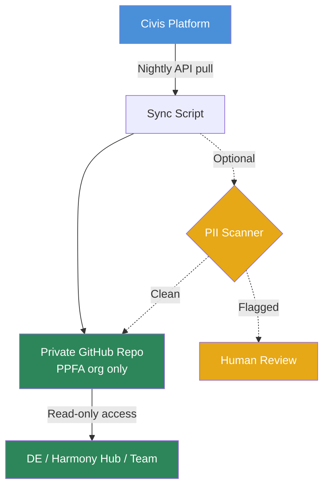

# Civis Mirror: One-Way Sync to Git

## Summary

We have thousands of scripts in Civis, but finding what you need is a pain — there's no good way to search across script contents, no version history, and it's hard to piece together how scripts relate to each other. This proposal is for a nightly service that copies Civis scripts into a private GitHub repo under the PPFA org, giving us real search, version history, and a starting point for organizing things better.

## Value

Right now, finding scripts and identifying data flow in Civis means a lot of searching, clicking, and painstakingly piecing together information. A civis mirror gives us:

- **Better search**: We can find every script that touches a specific table or dataset — something that's technically possible in Civis but really frustrating in practice.
- **History of scripts**: We can see how scripts have changed over time, compare versions, and roll back if something breaks.
- **Visibility**: We can browse and read through the codebase without hunting down and opening scripts one by one in Civis.
- **Organization**: Down the road, we can start grouping and classifying scripts so the codebase is easier to navigate.

### How DE and Harmony Hub would use this day-to-day

- **Tracing data pipelines**: When investigating an issue or building something new, DE can search for every script that touches a table and see how they connect — instead of hunting through Civis one at a time.
- **Onboarding**: A new team member can browse the codebase, find examples, and get up to speed without needing someone to walk them through everything.
- **Catching regressions**: When a script changes unexpectedly, the daily diff shows what was edited and when — helpful for debugging issues that show up downstream.
- **Harmony Hub**: Scripts become linkable and taggable, which feeds into broader knowledge management and documentation.
- **Accountability**: We get a complete record of what code existed and when — useful for audits or just understanding how things got to where they are.

## What currently exists on Civis?

Civis contains thousands of scripts of varying kinds:

| Asset Type | Count | What's Stored |
|-----------|-------|--------|
| SQL scripts | ~26,000 | Code + metadata |
| Python scripts | ~8,900 | Code + metadata |
| Containers | ~17,900 | Configuration (arguments, params, schedule) |
| Workflows | 513 | Pipeline definitions |
| JS/R/dbt scripts | ~170 | Code + metadata |

## Proposal

A nightly Civis container script pulls scripts from the Civis API, scans them for personal information, and pushes them to a private GitHub repo under the PPFA org. Once it's set up, it runs on its own — no manual steps. It's the only thing that writes to the repo; everyone else gets read-only access.

Each mirrored file includes metadata (author, dates, project folder, tags) and a direct link back to the script in Civis.

### PII

Scripts in Civis are code — they shouldn't contain personal information, and we're not too worried about it. That said, we can build in an automated pattern scanner as a safety net that catches things like email addresses, phone numbers, SSNs, and Salesforce case IDs. We tested it on 938 SQL scripts and 22 were flagged (2.3%), all routed to human review.

The repo itself is private and only accessible to PPFA team members, so even in a worst case where something like a donor name slips through, exposure is limited. And if it does happen, we can delete the affected file and wipe it from the repo's history entirely — GitHub supports permanent removal of sensitive data.

In the future, we could look into NER (named entity recognition) systems for catching things like names and addresses, but that's not a priority right now.

## Scope & Recommended Path Forward

| Step | Estimate | Status |
|------|----------|--------|
| Create private repo under PPFA GitHub org | ~0.5 day | — |
| Create PPFA-owned GitHub credential on Civis | ~0.5 day | Tested with [personal credential](https://platform.civisanalytics.com/spa/#/credentials/38869) — needs PPFA-owned one |
| Pull scripts from API, extract metadata, push to GitHub | ~2–3 days | [Tested](https://platform.civisanalytics.com/spa/#/scripts/python3/347646218) |
| Incremental sync (nightly updates — only changed scripts get updated) | ~1–2 days | Not yet tested |
| Initial backfill — all scripts active in the last year (~4,500 SQL + ~3,700 Python), organized by type, no further categorization | ~0.5 day | — |

Potential future work:
- **Organization**: Add project folder structure, tagging, or classification layers on top of the mirrored code.
- **Broader backfill**: Expand beyond the last year to older scripts, or include containers, workflows, and other asset types.
- **PII scanner improvements**: Look into NER systems for name/address detection, refine false positives based on what the initial scan surfaces.
- **Dependency mapping**: Trace how scripts connect — which scripts feed into which workflows, what tables they share.
- **Alerts/notifications**: Flag when important scripts change unexpectedly.

## Risks

- **PII leakage**: A script could contain a donor name, email, or other personal info. Mitigated by the PII scanner and the fact that the repo is private to PPFA. If something does slip through, we can wipe it from history.
- **Stale mirror**: If the nightly sync breaks silently, the repo drifts out of date without anyone noticing. We'd want some kind of alerting or monitoring to catch this.
- **Credential management**: The sync service needs a PPFA-owned GitHub login (not a personal account) that's kept up to date.
- **Scope creep**: The mirror is read-only — if people start treating it as the source of truth or editing scripts there instead of Civis, things get confusing fast.

## Open Questions

1. Which PPFA GitHub org/account should the repo live under?
2. Daily or weekly sync?
3. Where does metadata live — embedded in each file as a header, or as a separate companion file?
4. Anything else we should scan for beyond the current PII patterns?

